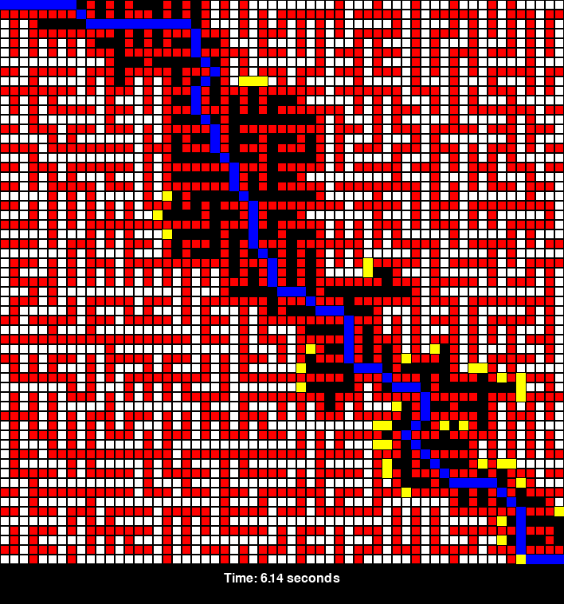
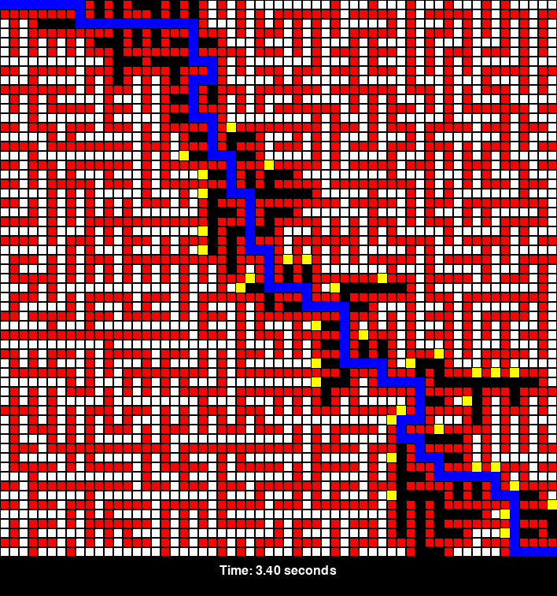
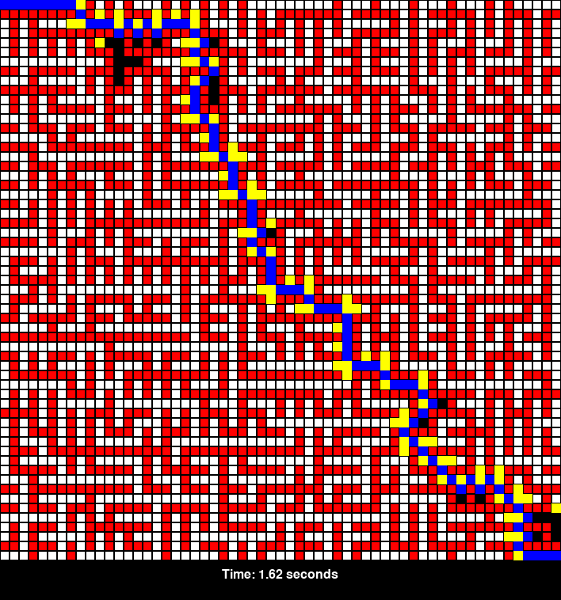

# INTRODUCTION
## Artificial_Intelligence
## PHAM DANG KHUE 

#### Algorithm: Focal Any-Angle A* (FA_A*) on maze
#### Languege : Python3
#### Libs     : Numpy,Pygame,Pillow,....

# INSTALL:

pip install numpy
pip install Pillow
pip install pygame

# HOW TO USE:

run '0.maze_generator.py' to make maze
(You can change width and height at line 61,63 in this with EDIT-MODE or any IDE PYTHHON)
    file maze.txt 
    file maze.png       in Maze_Source

run '1.FA-A_Star.py'      to run FA_A*
    file FA-A_Star.png  in RESULT

run '2.A_Star.py'         to run A* 
    file A_Star.png     in RESULT

run '3.Theta_Star.py'     to run Theta*
    file Theta_Star.png in RESULT

